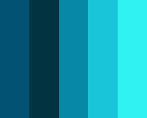

# Color Machine #

Color Machine is a tool for creating color palettes. It uses a self-organizing
map to generate new color palettes.

## Usage ##

```bash
npm install
node random-palettes.js 4000 > palettes.json
node color-machine.js palettes.json
open color-machine.png
```

## Palette Format ##

Palettes are expressed as a set of RGB colors. Each color has the format
`[red, green, blue, weight]`. The red, green, and blue components are in the
range 0 to 255. The weight component is in the range 0 to 1; it's the percentage
of space in the palette the color takes up.

```javascript
[
  [2, 83, 115, 0.2],
  [1, 52, 64, 0.2],
  [6, 136, 166, 0.2],
  [24, 197, 217, 0.2],
  [48, 242, 242, 0.2]
]
```

The image below was generated by running [example-palette.json](example-palette.json)
through the Color Machine.



## Credits ##

Color Machine was prompted by [a Twitter conversation][origin] with [Matt DesLauriers][].

## License ##

All code is licensed under a MIT license. See the [LICENSE](LICENSE) file for
more details.

[origin]: https://twitter.com/mattdesl/status/1258730249023438848 "Matt DesLauriers (Twitter): ML / AI friends — I have thousands of color palettes...I'd like to synthesize new palettes..."
[Matt DesLauriers]: https://github.com/mattdesl "Matt Des (GitHub): @mattdesl"
